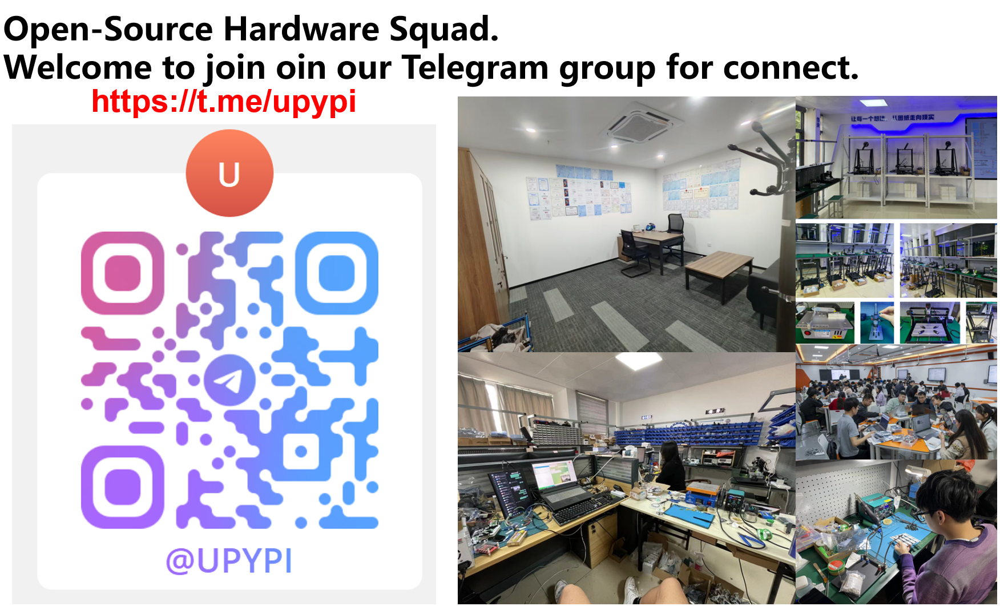

[中文版本](./README-zh.md)
# uPyPi: A PyPI-like MicroPython Package Repository
`uPyPi` is a dedicated package management hub for the MicroPython ecosystem, designed to simplify the discovery, sharing, and deployment of MicroPython libraries and drivers.

## Core Features
* Package Management: A PyPI-inspired repository system that supports uploading, browsing, downloading, and managing your MicroPython packages.
* JSON Metadata Parsing: All packages require a `package.json` file to define core metadata (e.g., name, version) to ensure consistency and compatibility.
* Bilingual Support: The interface supports one-click switching between Chinese and English for global accessibility.
* Chip & Firmware Filtering: Discover packages tailored to specific hardware (e.g., `RP2040`) and firmware environments.
* Personal Dashboard: Track and manage all your uploaded packages in a unified interface with a clear overview of your contribution records.

## Related Information
* Platform URL: https://upypi.net/
* User Guide: https://f1829ryac0m.feishu.cn/wiki/WZtiwbHVjirCc1k6Z3ZcSjF2nvb?from=from_copylink

# Deployment
## Translation Functionality
### Initialization
    * pybabel extract -F babel.cfg -o messages.pot .
    * pybabel init -i messages.pot -d translations -l zh
    * pybabel init -i messages.pot -d translations -l en

### Update
    * pybabel extract -F babel.cfg -o messages.pot .
    * pybabel update -i messages.pot -d translations
    * pybabel compile -d translations

## Run the Project
1. Build the container: podman build -t upypi .
2. Run the container: podman run -d -p 8080:443 upypi (Prepare certificate files and persistent directories yourself)

# About Us
